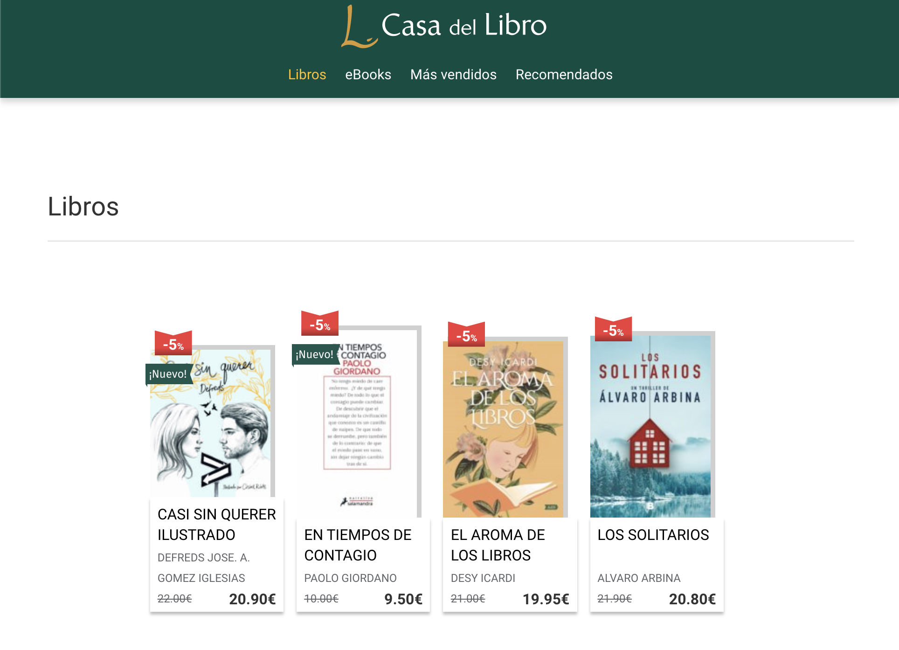
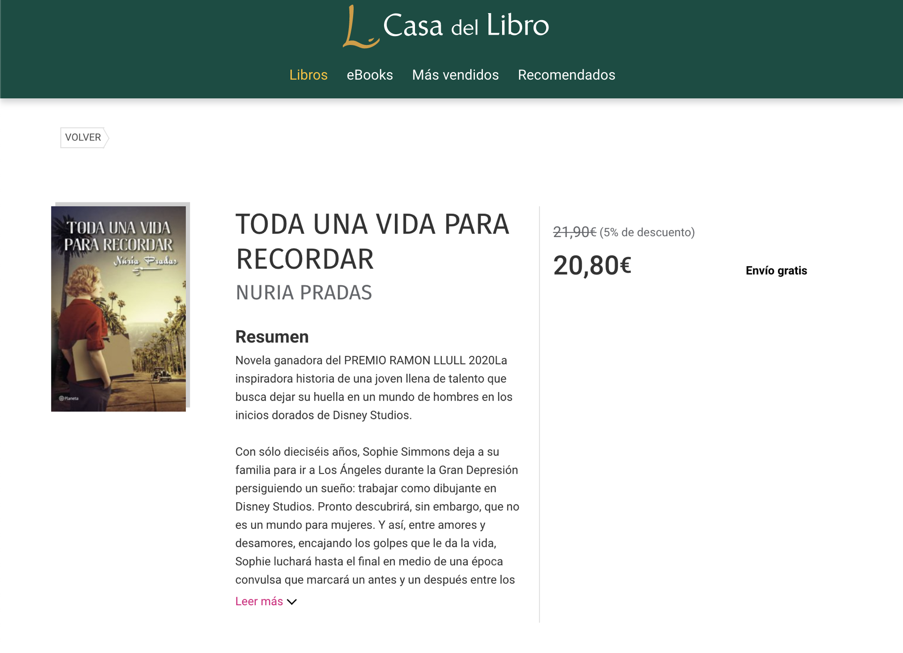

# Angular Sesión 6 - Ejercicios

Vamos a hacer nuestra web de libros!

Vas a ver como juntando lo que hemos ido aprendiendo:

- Peticiones a APIS
- Enrutamiento
- Componentes

Eres capaz de crear tu catálogo de libros al más puro estilo La Casa Del Libro.

Cuando acabes tu web debería lucir así:



Para pintar el listado de libros de cada sección ponemos a tu disposición las siguientes peticiones:

Libros: [https://jsonblob.com/api/04a43a46-9c5b-11ea-bc24-4fb2126bc5f5](https://jsonblob.com/api/04a43a46-9c5b-11ea-bc24-4fb2126bc5f5)

eBooks: [https://jsonblob.com/api/32c27e81-9c5d-11ea-bc24-9b1a9e6e00dc](https://jsonblob.com/api/32c27e81-9c5d-11ea-bc24-9b1a9e6e00dc)

Más vendidos: [https://jsonblob.com/api/cf377108-9c5d-11ea-bc24-897b825741bb](https://jsonblob.com/api/cf377108-9c5d-11ea-bc24-897b825741bb)

Recomendados:

Realiza una web que tenga 4 rutas diferentes para mostrar cada uno de los listados. Desde cada pagina se hará la petición a un servicio de Angular que devolverá el listado de libros para pintarlos en la vista.

Recuerda que debes marcar en qué página se encuentra el usuario en el menú.

Si te has fijado los libros se muestran siempre igual, así que aprovecha para hacer un componente libro para poder mostrar los detalles de una forma más cómoda.

### **BONUS**

Desarrolla también la página de detalle de un libro donde mostrarás los detalles de un libro al ser clicado, debería tener un aspecto como este:

Para mostar el resumen puedes usar un lorem ipsum, no pasa nada :)



### POR SI ACASO...

Por si tienes algún problema con las APIS, y a modo de referencia te dejamos los objetos que deberían devolverte las peticiones GET

Libros:

```json
[
    {
        "title": "CASI SIN QUERER ILUSTRADO",
        "price": 20.99,
        "priceOriginal": 22,
        "author": "DEFREDS JOSE. A. GOMEZ IGLESIAS",
        "imageUrl": "https://imagessl2.casadellibro.com/a/l/t1/62/9788417938062.jpg",
        "isNew": true,
        "discountPercentage": 5
    },
    {
        "title": "EN TIEMPOS DE CONTAGIO",
        "price": 9.50,
        "priceOriginal": 10,
        "author": "PAOLO GIORDANO",
        "imageUrl": "https://imagessl2.casadellibro.com/a/l/t1/42/9788418107542.jpg",
        "isNew": true,
        "discountPercentage": 5
    },
    {
        "title": "EL AROMA DE LOS LIBROS",
        "price": 19.95,
        "priceOriginal": 21,
        "author": "DESY ICARDI",
        "imageUrl": "https://imagessl0.casadellibro.com/a/l/t1/90/9788491818090.jpg",
        "isNew": false,
        "discountPercentage": 5
    },
    {
        "title": "LOS SOLITARIOS",
        "price": 20.80,
        "priceOriginal": 21.90,
        "author": "ALVARO ARBINA",
        "imageUrl": "https://imagessl7.casadellibro.com/a/l/t1/67/9788466666367.jpg",
        "isNew": false,
        "discountPercentage": 5
    }
]
```

eBooks:

```json
[
    {
        "title": "CON EL AMOR BASTABA (EBOOK)",
        "price": 9.49,
        "priceOriginal": 9.99,
        "author": "MAXIMO HUERTA",
        "imageUrl": "https://imagessl8.casadellibro.com/a/l/t1/98/9788408227298.jpg",
        "isNew": true,
        "discountPercentage": 5
    },
    {
        "title": "A PROPÓSITO DE NADA (EBOOK)",
        "price": 12.82,
        "priceOriginal": 13.50,
        "author": "WOODY ALLEN",
        "imageUrl": "https://imagessl7.casadellibro.com/a/l/t1/67/9788491819967.jpg",
        "isNew": true,
        "discountPercentage": 5
    },
    {
        "title": "LOBA NEGRA (EBOOK)",
        "price": 4.27,
        "priceOriginal": 4.49,
        "author": "JUAN GOMEZ-JURADO",
        "imageUrl": "https://imagessl9.casadellibro.com/a/l/t1/19/9788466666619.jpg",
        "isNew": false,
        "discountPercentage": 5
    },
    {
        "title": "LA BIBLIA DE MASTERCHEF (EBOOK)",
        "price": 8.54,
        "priceOriginal": 8.99,
        "author": "SHINE",
        "imageUrl": "https://imagessl9.casadellibro.com/a/l/t1/49/9788467059649.jpg",
        "isNew": true,
        "discountPercentage": 5
    }
]
```

Más vendidos: 

```json
[
    {
        "title": "REINA ROJA",
        "price": 19.85,
        "priceOriginal": 20.90,
        "author": "JUAN GOMEZ-JURADO",
        "imageUrl": "https://imagessl7.casadellibro.com/a/l/t1/17/9788466664417.jpg",
        "isNew": false,
        "discountPercentage": 5
    },
    {
        "title": "EN LOS ZAPATOS DE VALERIA",
        "price": 9.45,
        "priceOriginal": 9.95,
        "author": "ELISABET BENAVENT",
        "imageUrl": "https://imagessl3.casadellibro.com/a/l/t1/73/9788490628973.jpg",
        "isNew": false,
        "discountPercentage": 5
    },
    {
        "title": "UN CUENTO PERFECTO",
        "price": 17.00,
        "priceOriginal": 17.90,
        "author": "ELISABET BENAVENT",
        "imageUrl": "https://imagessl6.casadellibro.com/a/l/t1/16/9788491291916.jpg",
        "isNew": false,
        "discountPercentage": 5
    },
    {
        "title": "LA CHICA DE NIEVE",
        "price": 17.95,
        "priceOriginal": 18.90,
        "author": "JAVIER CASTILLO",
        "imageUrl": "https://imagessl1.casadellibro.com/a/l/t1/61/9788491292661.jpg",
        "isNew": false,
        "discountPercentage": 5
    }
]
```

Recomendados:

```json
[
    {
        "title": "SALVAR EL FUEGO",
        "price": 19.85,
        "priceOriginal": 20.90,
        "author": "GUILLERMO ARRIAGA",
        "imageUrl": "https://imagessl.casadellibro.com/a/l/t1/03/9788420439303.jpg",
        "isNew": false,
        "discountPercentage": 5
    },
    {
        "title": "NOCHE Y OCEANO",
        "price": 19.85,
        "priceOriginal": 20.90,
        "author": "RAQUEL TARANILLA",
        "imageUrl": "https://imagessl.casadellibro.com/a/l/t1/49/9788432236549.jpg",
        "isNew": false,
        "discountPercentage": 5
    },
    {
        "title": "LAS BRUJAS",
        "price": 17.10,
        "priceOriginal": 18.00,
        "author": "CELSO CASTRO",
        "imageUrl": "https://imagessl.casadellibro.com/a/l/t1/85/9788423357185.jpg",
        "isNew": false,
        "discountPercentage": 5
    },
    {
        "title": "TODA UNA VIDA PARA RECORDAR",
        "price": 20.80,
        "priceOriginal": 21.90,
        "author": "NURIA PRADAS",
        "imageUrl": "https://imagessl.casadellibro.com/a/l/t1/69/9788408225669.jpg",
        "isNew": false,
        "discountPercentage": 5
    }
]
```